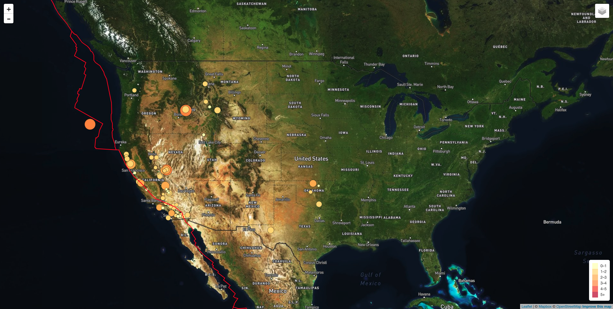

# Visualizing USGS Earthquake Data
This project uses USGS data to visualize earthquake data using leaflet. The data is in a GeoJSON format that is pulled from a live API feed on United States Geological Survey's (USGS) website. The API feed includes data from the past hour, day, 7 days, and 30 days, all of which are updated every minute. In this project, all earthquakes from the past day is used (https://earthquake.usgs.gov/earthquakes/feed/v1.0/summary/all_day.geojson).

## Data
- USGS earthquakes https://earthquake.usgs.gov/earthquakes/feed/v1.0/geojson.php
- Tectonic Plate Boundaries https://raw.githubusercontent.com/fraxen/tectonicplates/master/GeoJSON/PB2002_boundaries.json

## Visualization
The map visualization is deployed here: https://hannah8075.github.io/leaflet-challenge/

The final map visualization is shown below. 

